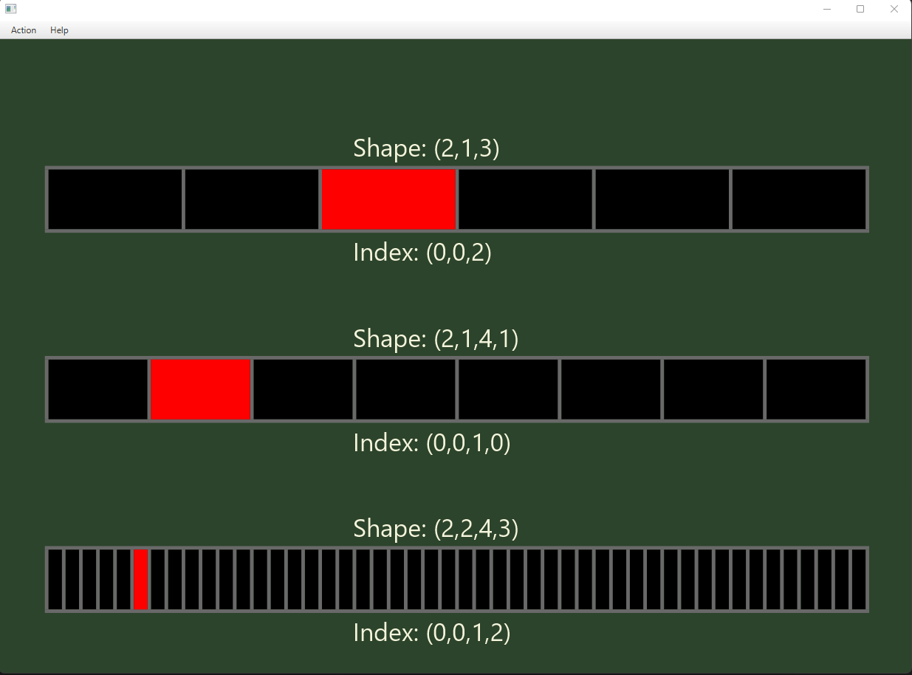

# Tensor Iterator

UI to illustrate iteration on tensors, reshape and slice. To run the application:
```bash
mvn javafx:run
```

The input format for shapes is: `d1 d2 d2`. For example for a tensor of shape `(2,3,5)`: `2 3 5`.

The input format for slices is: `(integer or nothing):(integer or nothing)`. For example, `: 2: 1:4` takes all the first dimension, from the index `2` included to the end of the second dimension and from index `1` to the index `4` excluded of the last dimension.

To iterate, click on the `Iterate` sub-menu and press a key, except the escape key that end the iteration.

[A video explaining tensor, reshape, slice and broadcasting.](https://youtu.be/FkE5XOrElVU)


To run the tests:
```bash
mvn test
```


